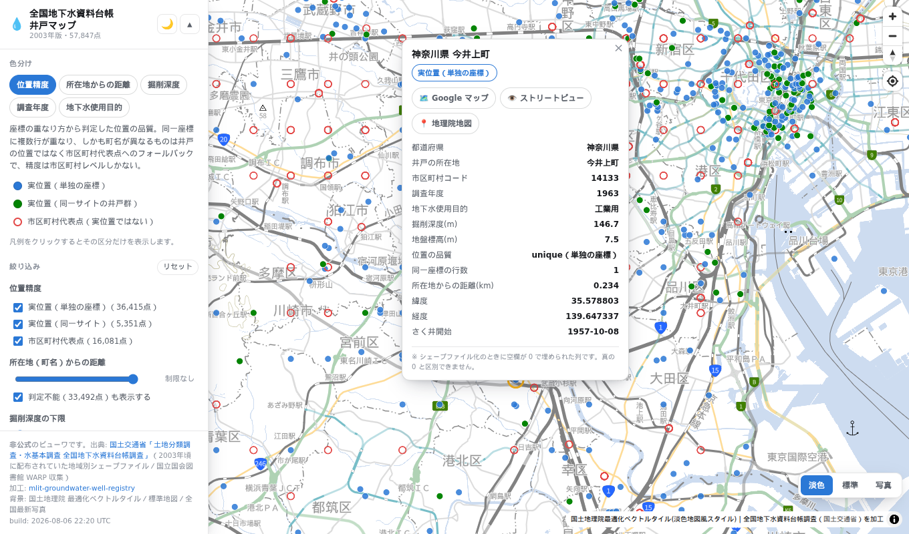

# mlit-groundwater-well-registry

国土交通省「[土地分類調査・水基本調査 全国地下水資料台帳調査](https://nlftp.mlit.go.jp/kokjo/inspect/landclassification/water/f9_exp.html)」（F9）の
都道府県別データを **1本のCSVにマージし、住所からジオコーディングして緯度経度を付与** したものです。

> [!IMPORTANT]
> **本リポジトリは非公式です。** 国土交通省が作成・配布しているものではありません。
> 元データの公式な配布元は上記の国土数値情報ダウンロードサイトです。
> 加工の過程で誤りが入り込んでいる可能性があるため、正確性が要求される用途では必ず原本を参照してください。

## このデータについて

昭和27年度以降に累積された **深井戸（概ね30m以深）71,198件** の記録です。掘削時の地質、揚水試験による帯水層情報、水質検査結果を含みます。

| ファイル | 内容 | 行 × 列 | サイズ |
|---|---|---|---|
| `output/f9_groundwater_all.csv` | 47都道府県をマージしたもの（原本の項目のみ） | 71,198 × 48 | 27MB |
| `output/f9_groundwater_all_geocoded.csv` | 上記に緯度経度と精度情報を付与したもの | 71,198 × 58 | 32MB |
| `output/f9_groundwater_wells.parquet` | **GeoParquet**（座標が付いた行のみ・点フィーチャ） | 64,873 × 57 | 8.5MB |
| `output/f9_pdf_truth_2012.csv` | 位置図PDFから復元した**井戸の真位置**（平成24年度・精度検証用） | 378 × 12 | 38KB |
| `output/f9_geocode_error_2012.csv` | 上記との突合結果（行ごとの実測誤差） | 374 × 16 | 42KB |
| `output/f9_wells_2003.csv` | **座標が入っていた2003年版**（配布終了。ジオコーディング不要） | 57,847 × 51 | 18MB |
| `output/f9_wells_2003.parquet` | 同上の GeoParquet | 57,847 × 52 | 5.7MB |
| `output/f9_2003_error_funabashi.csv` | 2003年版の座標を自治体データと突合した実測誤差 | 8 × 16 | 1KB |

CSVの文字コードは **UTF-8（BOMなし）**、改行は CRLF です。

**地図で見る** → https://shiwaku.github.io/mlit-groundwater-well-registry/ （2003年版の57,847点を位置精度で色分け。
[ビューワ（`viewer/`）](#ビューワviewer)）

> [!TIP]
> **座標の精度が要るなら `f9_wells_2003` の `POS_QUALITY == "unique"` を使ってください。**
> 2003年版は原本に緯度経度が入っており、実測誤差は**中央値約300m**とジオコーディングした現行版
> （町字で0.52km、市区町村で3.14km）より良好です。ただし**27.8%は市区町村代表点への
> フォールバック**なので、精度が要る用途では必ず絞り込みが必要です。
> 収録は57,847件・年次も2003年までなので、件数と新しさが要るなら現行版になります。詳しくは
> [座標が入っていた2003年版について](#座標が入っていた2003年版について)。
>
> ```python
> import geopandas as gpd
> g = gpd.read_parquet("output/f9_wells_2003.parquet")
> g[g.POS_QUALITY == "unique"]        # 36,415点。実位置とみなせるもの
> # さらに ADR_DIST_KM（自分の町字からの距離）で絞ると外れ値を落とせる
> ```

### GeoParquet について

GeoParquet **1.1.0**（WKB / EPSG:4326 / zstd圧縮）で、`covering`（bbox列）を含むため
DuckDB spatial などから空間フィルタを効かせた範囲読みができます。

```python
import geopandas as gpd
gdf = gpd.read_parquet("output/f9_groundwater_wells.parquet")
gdf[gdf.GC_CONFIDENCE == "high"].explore()
```

```sql
-- DuckDB
SELECT NEN, ADR, DEP, PH, GC_LEVEL FROM 'output/f9_groundwater_wells.parquet'
WHERE GC_CONFIDENCE = 'high' AND DEP > 200;
```

座標が付与できなかった6,325行はジオメトリを持てないため含まれていません（全行が必要な場合はCSVを参照）。
原本の `X`/`Y` 列は全行空なので落としています。

**型について。** 原本の列は原則そのまま文字列で保持しています。水質項目には
`不検出` `痕跡` `微量` `Ca併記` のような定性値が最大24.3%（`NH4-N`）含まれており、
数値化すると情報が落ちるためです。非空セルが100%数値であることを確認できた
`HEIGHT` `DEP` `SC` `SCL` `Q_01` `QSP_01` `TEMP` `PH` の8列のみ `float64` に変換しています
（`DIA` や `NWL_01` は `250～200` `自噴` `水なし` などを含むため文字列のまま）。

## なぜジオコーディングが必要か

**原本には緯度経度が入っていません。** 項目定義（`doc/koumoku.xls`）に「4. 緯度・経度：非表示」と明記されており、
`X`/`Y` 列は全71,198行が空でした。位置情報は `ADR`（井戸の所在地）列のみで、しかも
**都道府県名も市区町村名も含まれない町名・大字だけ**（平均4.3文字）です。

さらに `MUNI_CD`（`PREF`+`CITY`）の **17.7%（12,568行 / 1,284コード）が現行の市区町村コード表に存在しません**。
調査年度が1952〜2024年にわたるため、平成の大合併前のコードが混在しています。

そのため「コードから自治体名を復元 → 住所文字列を合成 → 正規化 → 座標付与」という工程が必要になります。

## ジオコーディング結果

| 精度レベル | 行数 | 割合 | 内容 |
|---|---:|---:|---|
| `town` 町字レベル | 44,132 | 62.0% | 町字の代表点。**丁目まで確定しているのは5,328行のみ**（後述） |
| `oaza` 大字・地区レベル | 5,678 | 8.0% | 該当する複数町字の重心 |
| `city` 市区町村レベル | 15,063 | 21.2% | 市役所などの代表点 |
| `none` 座標なし | 6,325 | 8.9% | 自治体を特定できず |
| **座標付与できた行** | **64,873** | **91.1%** | |

信頼度（`GC_CONFIDENCE`）別では high 53.4% / medium 12.3% / low 25.4% です。

**精度の上限について。** 項目定義に「都市部は町名、その他は大字程度まで」とある通り、原本の住所粒度は
町名・大字レベルです。実測でも原本の84.2%が町・大字までしか記録していませんでした（次節）。
**番地レベルの精度は原理的に出ません**（数百mオーダーが上限）。
個々の井戸のピンポイントな位置としては使えない前提でご利用ください。

## 住所粒度の実態

`GC_LEVEL=town` は「町字が確定した」という意味で、**丁目まで確定しているとは限りません**。
実際の粒度は次のとおりです。

| 粒度 | 行数 | 割合 |
|---|---:|---:|
| **番地単位** | **0** | **0.0%** |
| **町丁目単位**（`南八条西十五丁目` など） | 5,328 | 7.5% |
| **町・大字単位**（`宮の森` `篠路町` など） | 44,482 | 62.5% |
| 市区町村単位 | 15,063 | 21.2% |
| なし | 6,325 | 8.9% |

番地単位が0件なのは、`04_geocode.mjs` で `normalize(addr, {level: 3})` と町字止めにしているためです
（level 8 まで解決させると町字ごとに地番データの取得が発生し処理量が数十倍になる）。
番地相当の情報を含む行は原本全体の2.6%しかなく、うち3,089行では番地部分を未解決のまま捨てています。

### 原本が持っている粒度（到達可能な上限）

重要なのは、**この粗さの大半は原本側の制約**だという点です。

| 原本 `ADR` の粒度 | 行数 | 割合 |
|---|---:|---:|
| 町・大字のみ | 59,967 | **84.2%** |
| 丁目あり | 5,266 | 7.4% |
| 番地相当あり | 1,844 | 2.6% |
| 空 | 4,121 | 5.8% |

**原本の84.2%が町・大字までしか記録していません。** 丁目以上の情報を持つのは10.0%だけです。
つまり町丁目単位の上限は約10%で、実績7.5%はその大半を取り切っています。

| 原本の粒度 | 町丁目/町・大字で解決 | 市区町村止まり | なし |
|---|---:|---:|---:|
| 丁目あり (5,266) | **4,535 (86%)** | 670 | 61 |
| 町・大字のみ (59,967) | 43,874 (73%) | 11,080 | 5,013 |
| 番地相当あり (1,844) | 1,401 (76%) | 259 | 184 |
| 空 (4,121) | 0 | 3,054 | 1,067 |

### 改善余地があるのはどこか

原本に町名が書かれているのに市区町村止まり／座標なしになった **17,246行** が真の取りこぼしです。原因の内訳:

| 原因 | 行数 | 割合 |
|---|---:|---:|
| 通称・旧地名・誤記など | 12,480 | 72.4% |
| 2文字以下（情報不足） | 2,322 | 13.5% |
| 位置注記のみ（`林班` `地内` `地先` 等） | 1,365 | 7.9% |
| 施設名が主体（`◯◯小学校` `◯◯工場` 等） | 852 | 4.9% |
| 条丁目で丁目が欠落 | 122 | 0.7% |
| 線・号（開拓地の区画表記） | 105 | 0.6% |

最大要因は公式の町字名でない通称・誤記です（札幌の `北大通西4丁目`〈公式には `大通西` のみ〉、
`狸小路3丁目`〈商店街名〉、`字桑園`〈地区の通称〉など）。地名辞書や通称対応表がないと解決できず、
機械的な部分一致で当てにいくと誤った位置を与えるリスクが上回ります。

## 精度の実測

> [!IMPORTANT]
> 下の1と2は間接的な見積もりです。**3で真位置と突合した実測値が得られたので、そちらを先に見てください。**
> 実測では `town` の誤差中央値は0.52kmで、見積もり（±0.2〜0.4km）より悪く、裾も長い（90%ile 2.88km）ことが判りました。

### 1. 位置の不確かさ（幾何的な見積もり）

| レベル | 不確かさ | 根拠 |
|---|---|---|
| `town`（町字） | **±0.2〜0.4 km**（実測は中央値0.52km） | 同一市区町村内の町字点どうしの最近傍距離は中央値0.42km（90%ile 0.82km）。井戸の真位置は町字内のどこかなので、誤差はその半分〜同程度 |
| `oaza`（大字・地区） | **中央値 0.27 km**（90%ile 0.75km） | 重心を取った町字群の広がりを行ごとに `GC_SPREAD_KM` 列として実測。1km超は519行、5km超は28行 |
| `city`（市区町村） | **中央値 3.4 km**（90%ile 7.3km、最大10.3km） | 市区町村代表点から域内の町字までの距離分布 |

### 2. 正しさ（独立系列との突合）

台帳の `HEIGHT`（2万5千分の1地形図から読み取った地盤標高）は、ジオコーディングとは**独立した系列**です。
付与座標における国土地理院DEMの標高と比較すれば、位置が正しいかを検証できます。
層化抽出した **1,203点**で実施しました。

まず、標高差は**地形の起伏に強く交絡**します。

| DEM標高帯 | n | 標高差 中央値 | 100m超 |
|---|---:|---:|---:|
| 0–20m（低地） | 552 | 2.0m | 1.8% |
| 20–100m | 387 | 5.7m | 1.3% |
| 100–300m | 178 | 32.0m | 23.6% |
| 300–800m | 76 | 90.6m | 48.7% |
| 800m+（山地） | 10 | 462.2m | 80.0% |

そのため**低地（DEM 100m以下・939点）に絞って**経路を比較しました。

| 経路 | n | 中央値 | 75%ile | 90%ile | 50m超 |
|---|---:|---:|---:|---:|---:|
| `A_oaza_exact` | 157 | **2.0m** | 5.4m | 16.8m | 0.6% |
| `A_normalize` | 155 | **2.7m** | 7.7m | 24.8m | 4.5% |
| `A_city_fallback` | 192 | 3.0m | 14.6m | 37.5m | 5.7% |
| `B_town_exact` | 174 | 3.4m | 11.1m | 34.2m | 5.7% |
| `B_town_suffix` | 227 | 4.1m | 17.2m | 43.3m | 8.8% |
| `A_oaza_prefix` | 34 | 9.9m | 20.3m | 47.3m | 8.8% |

**読み取り。** 低地では全経路で標高差の中央値が2〜10mに収まっており、**大半の座標は正しい位置**にあります。
序列も設計時の想定と一致します（`A_normalize` が良好、`B_town_suffix` が最も劣る）。

山地で標高差が大きくなるのは主に `A_city_fallback` です。市役所は谷筋の平地にあり井戸は山中にあるため、
**市区町村代表点フォールバックの仕様どおりの挙動**で、位置の誤りではありません。

> [!NOTE]
> この検証で `A_oaza_prefix` が当初の `medium` 格付けに見合わないことが判明したため（`A_oaza_exact` の
> 中央値2.0mに対し9.9m、重心の広がりも最大16km）、`low` に変更しました。標本が34点と小さい点は留保が必要ですが、
> `GC_SPREAD_KM` の実測とも整合しています。
> なお標高差は位置誤差そのものではなく、`HEIGHT` 自身の読み取り誤差と局所的な起伏を含む**代理指標**です。

### 3. 真位置との突合（位置図PDFから復元した378点）

原本に経緯度は無いのですが、同じサイトで参考公開されている
**公開用都道府県別地下水調査地点位置図（平成24年度）のPDF37本**には、その年度に調査された
563本の井戸が点で描かれています。ArcMap が原データのGISレイヤから出力したベクタPDFなので、
点の位置は**原データの座標そのもの**です。これを復元すれば正解データになります
（方法は後述の「位置図PDFから真位置を復元する」）。

採用できた **378点 / 32都道府県**との突合結果です。

| レベル | n | 中央値 | 平均 | 90%ile | 最大 |
|---|---:|---:|---:|---:|---:|
| `town`（町字） | 273 | **0.52 km** | 1.71 | 2.88 | 48.23 |
| `oaza`（大字・地区） | 21 | **0.30 km** | 0.45 | 0.74 | 2.11 |
| `city`（市区町村） | 80 | **3.14 km** | 4.91 | 9.81 | 27.82 |
| 全体 | 374 | **0.74 km** | 2.32 | 5.99 | 48.23 |

| しきい値 | 以内に収まる割合 |
|---|---:|
| 0.2 km | 15.5% |
| 0.5 km | 41.2% |
| 1.0 km | 58.6% |
| 2.0 km | 71.7% |
| 5.0 km | 89.0% |

**読み取り。**

- `oaza` の見積もり（中央値0.27km）と `city` の見積もり（中央値3.4km）は**実測とほぼ一致**しました
- `town` は見積もり（±0.2〜0.4km）より悪く、**中央値0.52km**。裾が長く90%ileで2.88kmあります
- 対応づけの検算として使用目的コードの一致率は**98.1%**でした（一致しない7件は原本側の不整合）

**誤差が大きい行の正体。** 上位は原本の住所文字列の欠落でした。

| 誤差 | 市町村 | 原本のADR | 実際 |
|---:|---|---|---|
| 28.6 km | 郡山市 | `町田母神字姉屋` | 正しくは「**田村**町田母神字姉屋」。原本から「田村」が落ちている |
| 24.4 km | 郡山市 | `町栃本字市穀` | 同じく「**田村**町栃本」 |
| 21.7 km | 郡山市 | `町田母神馬場入` | 同じく |
| 27.9 km | いわき市 | `川前町字棚木` | 文字列は正しいが正規化が別の町字に当たっている |

「田村」の欠落は**原本のzipを直接確認して原本側の問題と確定**しています（本リポジトリの加工では欠けていません）。
`city` レベルの大きな誤差（いわき市27.8km など）は、市域が広い自治体で代表点を返す仕様どおりの挙動です。

> [!NOTE]
> 378点のうち**7点はラベルの市町村ポリゴンから外れます**（残り1点は市町村コード 25292 が現行N03に無く判定不能）。
> 原本の市町村コード自体が誤っている行で、例えば熊本の1件はコードが益城町（43443）なのに座標は美里町の寒野にあります
> （美里町にも「寒野」があり、ADR `寒野地内` と整合するのは美里町側）。
> ジオコーディングは誤ったコードの重心を返すため、この17.6kmは誤差として計上しています。
> 最大は徳島の1件で、コードは小松島市（36203）なのに座標は53.6km離れた県西部にあります。
>
> | 県 | コード | 市町村 | はみ出し |
> |---|---|---|---:|
> | 36 徳島 | 36203 | 小松島市 | 53.6 km |
> | 23 愛知 | 23225 | 知立市 | 16.7 km |
> | 43 熊本 | 43443 | 益城町 | 10.8 km |
> | 07 福島 | 07505 | 古殿町 | 8.2 km |
> | 27 大阪 | 27215 | 寝屋川市 | 7.5 km |
> | 01 北海道 | 01692 | 中標津町 | 0.07 km |
> | 17 石川 | 17202 | 七尾市 | 0.06 km |
>
> 下2件は境界ぎわで、変換式の残差の範囲内です。上5件は原本側の不整合と考えられます。

## 位置図PDFから真位置を復元する

```bash
python3 scripts/09_pdf_truth.py --gpkg   # -> output/f9_pdf_truth_2012.csv / .gpkg
python3 scripts/10_eval_accuracy.py --csv # -> output/f9_geocode_error_2012.csv
```

PDFは **GeoPDF ではありません**（`/VP` `/Measure` `/GPTS` `/EPSG` いずれも0件、生バイト列に経緯度らしい数値も0件）。
井戸は `ESRIDefaultMarker` フォントのグリフとして、ページ座標だけを持って描かれています。

```
BT /ESRIDefaultMarker 1 Tf
9.71798 0 0 9.72009 301.79738 320.81983 Tm   ← ページ座標(pt)。緯度経度ではない
(!)Tj ET
```

そこで図中の行政界を N03（国土数値情報 行政区域）と重ね合わせて変換式を推定します。

1. **点群** … 「都道府県界」の線幅クラスの頂点。外枠と凡例の箱は軸平行判定で除く
2. **縮尺** … スケールバーの数字から `pt/km` を最小二乗で読む。目盛が等間隔でない（`0 5 10 20 30 40`）ため位置と値で回帰する。整理番号も数字なので、同一ベースラインかつ `0` を含む行だけを目盛と見なす
3. **初期値** … 4通り（縮尺固定＋位相相関 / ラベルの市町村重心 / 県全体bbox / 最大ポリゴンbbox）
4. **仕上げ** … アフィンICP（縮尺がスケールバーから5%以上外れる解は破棄）→ 2次多項式で元の投影法のずれを吸収
5. **候補の選択** … **残差ではなく「点がラベルの市町村1km以内に収まった数」**で選ぶ

図の実測から、この図は「北上・緯度方向111km/度・経度方向は cos(緯度) 補正」の素朴な等距円筒とみなせます
（y方向の縮尺はスケールバーと0.2%以内で一致、せん断はほぼ0）。

> [!WARNING]
> **5番が最も重要です。** 残差で候補を選ぶと「図を縮めて境界線の上に乗せた偽解」の方が残差が小さくなります。
> 岐阜では縮尺が0.007倍まで潰れた解が勝っていました。ラベルの市町村コードは図から独立に読めるため、
> これが唯一の外部基準になります。

マーカーとラベルの対応づけは、距離・マーカー色と使用目的コードの一致・市町村からのはみ出し量（上限3km）を
費用とする1対1割当（ハンガリアン法）で決めます。凡例のマーカーはどの市町村にも入らないので自然に外れます。

### 精度と採否

| 指標 | 値 |
|---|---|
| 復元した点 | **378点 / 32都道府県** |
| 変換式の残差 中央値 | **28 m**（最大は北海道の134m） |
| ラベルの市町村に収まった点 | 370/378 |

残差が小さいのは、県ごとの図の縮尺が1pt≒0.14〜0.34km（北海道のみ1.06km）と大きいためです。

採用は「点の9割以上がラベルの市町村1km以内に収まること」を条件にしており、次の5県は**不採用**です。

| 県 | 収まった点 | 原因 |
|---|---|---|
| 15 新潟 | 12/25 | 未特定 |
| 16 富山 | 64/74 | **図中に拡大図（図A）がある**。別縮尺の枠線が点群に混ざり、スケールバーも2本ある |
| 21 岐阜 | 12/43 | 未特定 |
| 22 静岡 | 9/35 | 富山と同じく拡大図がある |
| 28 兵庫 | 7/8 | 1点が10.2km外れ、8点しかないため9割を満たさない |

不採用の4県（15/16/21/22）で失う点は177点あり、**拡大図への対応が最大の改善余地**です。

また位置図と台帳の件数が完全に一致しない県があります。位置図にあって台帳の`NEN=2012`に無い井戸が3件
（山形363・奈良203・高知405）、混み合った場所でラベルが取れない点が新潟に2件・静岡に1件あります。
突合スクリプトは件数が合わない市町村を除外して報告します。

## QGIS で位置を検証する

```bash
python3 scripts/08_export_for_qgis.py --dem 2500 --level town
```

`output/f9_groundwater_wells_qgis.gpkg`（3レイヤ）が出力されます。

| レイヤ | 件数 | 内容 |
|---|---:|---|
| `wells_all` | 64,873 | 座標が付いた全行 |
| `wells_high` | 38,038 | `GC_CONFIDENCE=high` のみ |
| `wells_check` | 3,707 | 検証優先度が高い行（DEM差50m超・重心の広がり1km超・low信頼度） |

検証用に2列が追加されます。

- **`GC_STACK_N`** … 同一座標に重なっている井戸の件数
- **`GC_DEM` / `GC_DEM_DIFF`** … 国土地理院DEMの標高と `HEIGHT` との差（`--dem` 指定時）

> [!IMPORTANT]
> **座標は井戸1本ごとではありません。** 64,873行に対しユニークな座標は **25,651点**だけです。
> 同じ町字の井戸は同一点に重なります（金沢市役所の1点に429件）。
> QGISで点を見るときは `GC_STACK_N` で必ず確認してください。`GC_STACK_N=1` の単独点は14,773行だけです。

### 背景地図（XYZタイル）

QGIS の Browser → XYZ Tiles → New Connection に登録します。

| 用途 | URL |
|---|---|
| 標準地図（町名が確認できる） | `https://cyberjapandata.gsi.go.jp/xyz/std/{z}/{x}/{y}.png` |
| 淡色地図 | `https://cyberjapandata.gsi.go.jp/xyz/pale/{z}/{x}/{y}.png` |
| 空中写真（最新） | `https://cyberjapandata.gsi.go.jp/xyz/seamlessphoto/{z}/{x}/{y}.jpg` |

出典表示は「国土地理院」。最大ズームは std/pale が18、seamlessphoto が18です。

### 現実的な検証手順

1. **標準地図で町名を突き合わせる**（最も有効）。点が `ADR`／`GC_ADDR_USED` の町名の範囲内にあるかを見る。ズーム15〜17で町名ラベルが出ます。
2. **`GC_DEM_DIFF` で異常値を絞る**。`wells_check` レイヤを開き、差が大きい行から見る。ただし山地では地形起伏で差が出るため、平野部の大きな差ほど疑わしい。
3. **立地の妥当性を見る**。海上・河川内・山頂などにあれば誤り。

> [!WARNING]
> **空中写真での目視確認はほとんど機能しません。** 深井戸の地上部はポンプ室程度の小さな構造物か、
> 舗装下に埋設されていて写真に写りません。「その位置に井戸があるか」を画像で直接確かめるのは
> 原理的に困難です。**検証できるのは「住所の解釈が正しいか」まで**で、井戸そのものの実在確認には
> 現地調査か、井戸台帳を持つ自治体への照会が必要です。

## 他に座標付きの井戸データはあるか

**現に配布されているものの中には見つかりませんでした。** 座標を持つものは「利用者が限定される」
「井戸ではない」「全国横断でない」のいずれかに当たります。唯一の例外が**配布終了した2003年版**で、
これは実物を入手できたため収録しています（後述）。

| データ | 件数 | 座標 | 制約 |
|---|---:|---|---|
| **全国地下水資料台帳 2003年版**（`output/f9_wells_2003.*`・後述） | 57,847 | **あり** | **日本測地系の秒単位（約30m）**。配布終了・年次は2003年まで |
| 本データ（2024年版・原本） | 71,198 | **なし** | 「調査地点の経緯度は掲載しておりません」 |
| [地下水データベース](https://chikasui-db.mlit.go.jp/)（国交省・内閣官房） | 非公表 | あり | **利用は地方公共団体に限定**。一般利用不可 |
| [KuniJiban](https://www.kunijiban.pwri.go.jp/jp/) | 約76,000 | あり | 井戸ではなく地質調査ボーリング。100件ずつのDL |
| [ジオ・ステーション](https://www.geo-stn.bosai.go.jp/)（防災科研） | 横断検索 | あり | 同上。複数DBのメタデータ検索 |
| 災害時協力井戸（各自治体） | 自治体ごと | あり | 全国横断の整備なし。浅井戸中心 |

## 座標が入っていた2003年版について

現行の配布物には緯度経度がありませんが、**2011年頃まで併せて配布されていた「地域別zip」8本の中身は
シェープファイル**で、点フィーチャとして座標を持っていました。合計 **57,847点**。これを
`output/f9_wells_2003.*` として収録しています。

### どこから入手したか

配布元の `tochi.mlit.go.jp` は消滅しており、Wayback Machine にも地域別zipは残っていません。
**国立国会図書館の WARP（インターネット資料収集保存事業）が2009年2月17日に収集したもの**が現存する唯一の実体です。

```
https://warp.ndl.go.jp/20090319/20090217012940id_/
  http://tochi.mlit.go.jp/tockok/tochimizu/F9/data/{hokkaido|touhoku|kantou|hokuriku|
                                                    chuubu|kinki|c_shikoku|kyuushuu}.zip
```

WARP の実体は pywb なので、`{コレクションID}/{タイムスタンプ}id_/{原URL}` で生ファイルが返ります
（`id_` を付けないと閲覧用のHTMLラッパーが返る）。取得は `scripts/11_download_shp2003.py` が行います。

見落としやすい点が2つあります。**都道府県別zip（`01.zip`〜`47.zip`）の中身は `.dat`（TSV）で、
X/Y列は確認した限りどの年代のものも全行空**でした（2004年・2009年・2011年・2013年の実物を開いて確認）。
座標を持っているのは地域別zipだけです。
そして地域別zipは**WARPにしか無く**、Wayback Machine だけを見ていると存在ごと見落とします。

正しいデータであることは2点で裏が取れています。**合計57,847点が
[G-Space](https://www.gspace.jp/well.html) の公開する件数と完全一致**し（同社は「2009年8月にダウンロード」
と明記。北海道4,373点・石川県3,307点・愛知県2,989点なども都道府県別に一致）、DBFの `S_TKY2JGD` 列のとおり
**日本測地系からJGD2000への変換済み**であることが座標の分布からも確認できます（次節）。

### 位置の品質（27.8%は実位置ではない）

**同一座標に複数行が重なり、しかも町名が異なるものがあります。** 大阪市中央区の1点には71種類の町名、
板橋区の1点には25種類の町名の井戸が載っています。これは井戸の位置ではなく
**市区町村代表点へのフォールバック**で、精度は市区町村レベルしかありません。
判別できるよう **`POS_QUALITY`** 列を付けました。

| `POS_QUALITY` | 行数 | 割合 | 内容 |
|---|---:|---:|---|
| `unique` | 36,415 | **63.0%** | 単独の座標。実位置とみなせる |
| `site` | 5,351 | 9.3% | 複数行が同一座標だが町名は同一。同一サイトの井戸群と解釈できる |
| `fallback` | 16,081 | **27.8%** | 複数行が同一座標で町名が異なる。**実位置ではない** |

このフラグが効いていることは実測で確認しています。両者で住所の解釈が一致しているはずの行
（現行版のジオコーディングが町字を高信頼で確定した22,718行）に限って、2003年版の座標が
その町字の代表点からどれだけ離れているかを見ると、`fallback` だけ明確に外れます。

| `POS_QUALITY` | n | 中央値 | 90%ile | 5km超 |
|---|---:|---:|---:|---:|
| `unique` | 16,417 | 0.55km | 2.47km | 3.7% |
| `site` | 2,854 | 0.30km | 1.76km | 2.0% |
| `fallback` | 3,447 | **1.34km** | **5.65km** | **12.5%** |

### 行ごとの疑わしさ（`ADR_DIST_KM`）

`POS_QUALITY` は座標の重なり方しか見ないので、**単独の座標でも値が誤っていれば `unique` になります**。
行ごとに見るための独立した指標として、**その点が自分の `ADR`（町名）の位置に落ちているか**を
住所マスタとの距離で持たせました。同名の町字は各地にあるため、県内で一箇所に定まる地名
（同名町字群の広がりが2km以内）だけを使っており、解決できるのは42.1%（24,355行）です。残りは空になります。

| `POS_QUALITY` | n | 中央値 | 5km超 |
|---|---:|---:|---:|
| `unique` | 15,452 | 0.59km | **11.2%** |
| `site` | 3,241 | 0.42km | 5.5% |
| `fallback` | 5,662 | 1.41km | 13.7% |

上の表とは**別経路（住所マスタを直接引く／現行版との突合を経ない）**で出した値ですが、
`unique` 0.59km・`fallback` 1.41km と同じ結論になり、品質フラグを裏付けます。
`unique` でも11.2%は自分の町字から5km以上離れているので、精度が要るなら併用してください。

```python
g[(g.POS_QUALITY == "unique") & (g.ADR_DIST_KM.astype(float) < 2)]   # より厳しく絞る
```

### 位置精度

**日本測地系の秒単位＝緯度1″≈30.9m、経度1″≈25m（北緯36°）** が原本の粒度です。
JGD2000から日本測地系へ逆変換すると緯度の秒がほぼ整数に揃います（残差の中央値0.025″。
これは検証に使った3パラメータ近似と正式な TKY2JGD 格子との差でほぼ説明できます）。
量子化だけを見れば RMS約12m ですが、**記録された秒の値そのものの誤差はこれより大きい**です。

実測には**自治体が公開している防災井戸のオープンデータ**を使いました
（`scripts/13_eval_2003_funabashi.py`）。災害時協力井戸の多くは住民登録の浅井戸でF9と母集団が
重なりませんが、**自治体が公共施設に設置した防災井戸は深井戸**なので重なります。船橋市は
さく井深度と番地までの住所を公開しているため、住所を国土地理院の住所検索APIで解決して正解にできます。
町名・深度・設置年の3点一致で対応づいた8点の結果です。

| | 誤差 |
|---|---|
| 8点の実測（すべて `POS_QUALITY == "unique"`） | **中央値 298m** / 平均 301m / 最大 490m |
| 平均ずれベクトル | 北+125m 東−42m（大きさ132m） |

正解側は施設の番地代表点なので、**学校敷地の広さ100m前後が正解自体の不確かさとして含まれます**。
実際の誤差はこれより小さいはずですが、n=8 と少ないので幅を持って見てください。
それでも位置図PDFで実測したジオコーディングの誤差（`town` 中央値0.52km、`city` 中央値3.14km）
より明確に良好です。

行政区域（N03）内判定も行い、6県17,038点のうち **99.72%** が自県の区域内に落ちました。
残り0.28%（全体では160件前後）は実際に誤りで、県外に出た点の区域からの距離は東京都で19点中6点が
1km超（最大4.8km）、京都府で3点中1点が6.9kmでした。海岸線の描画差では説明できない値です。
**個々の点を無条件に信用せず、用途に応じて自県・自市区町村に落ちるかの確認を挟んでください。**

> [!IMPORTANT]
> **座標はすでに JGD2000 です。日本測地系だと思って変換しないでください。** 原本の段階で
> 日本測地系から変換済みで、`EPSG:4326` としてそのまま扱えます。誤って変換すると
> **北483m・西334mの系統ズレ**が新たに乗ります（船橋市の8点で実測）。
> 保存値のままなら平均ずれは132mで向きも揃っておらず、二重変換していないことが確認できます。
> なお `S_TKY2JGD` 列は57,830行が `0`、17行が `1` で、変換の実施フラグではありません。

> [!NOTE]
> G-Space は「位置座標は、秒を丸め処理（全て00表記）」と注記していますが、これは**同社のPDF帳票での表示処理**
> であって原本の粒度ではありません。原本は秒まで入っています。

### 何が入っているか・原本の欠陥

DBFは45項目で、現行版とほぼ同じ調査項目（`NEN` `ADR` `DEP` `PH` ほか）を持ちます。
`scripts/12_shp2003_to_dataset.py` が8本をまとめ、`MUNI_CD`（`PREF`+`CITY` の5桁）、
`POS_QUALITY` / `POS_N`（前述）、`TEMP_KIND`（次項）を足して出力します。
原本の欠陥を2つそのまま引き継いでいます。

- **`TEMP` 列（C254）に水温と地質柱状図が混在します。** 本来 `GEOLOGY` にあるべき値が入っている行が
  7,535件、254バイトを超えて `###…` に潰れた行が591件あります。判別できるよう **`TEMP_KIND`**
  （`temp` / `geology` / `overflow` / 空）を足しました。水温として使うときは `TEMP_KIND == "temp"`
  で絞ってください（24,638件）。
- **`QSPD_02` `QSP_02` はフィールド長0で値を持たない**ため落としました。独立した `GEOLOGY` 列もありません。

> [!WARNING]
> **数値列は `0` が欠測を意味します。** シェープファイル化の際に空欄が0で埋められており、
> `PH` は64.7%、`FE` は64.6%、`CL` は57.9%、`Q_01` と `NWL_01` は29%が `0` です。
> pH 0 の井戸が全体の3分の2ある、というのは当然ながらデータ側の都合です。
> 現行版（`f9_groundwater_all.csv`）は空欄を空欄のまま持っているので、**水質や揚水量を集計する用途では
> 現行版を使い、2003年版は座標のためだけに使う**のが安全です。`DEP`（深度）のように0がほぼ無い列は影響を受けません。

住所は現行版の方が詳しい点にも注意してください。同じ井戸でも2003年版が `南25条西`、
2024年版が `南25条西11丁目` のように、**丁目が後年に補われています**。

### 精度検証に使えなかったもの（調査済み）

正解データを増やそうとして当たった先です。**いずれも使えませんでした。**同じ探索を繰り返さないために残します。

| 調べたもの | 結果 |
|---|---|
| 自治体の災害時協力井戸・防災井戸（豊島区・豊橋市・浜松市・水戸市・藤沢市・大磯町ほか） | **所有者の申請に基づく登録制で、浅井戸が中心**。F9（概ね30m以深）と母集団が重ならない |
| 練馬区の防災井戸 | 深さ100m前後の深井戸だが**2箇所のみ**。学校防災井戸は約25mでF9の対象外 |
| 白井市の災害用井戸（11箇所） | 番地までの住所はあるが**深度も設置年も非公開**で、F9の行と対応づけられない |
| 那覇市「井戸・湧水台帳」 | 170件。**湧水・カー**で深度が無く、母集団が違う |
| 環境省「全国地盤環境情報ディレクトリ」（72地域） | **地域ごとの集計統計のみ**。井戸ごとの座標・深度が無い |
| 都道府県の温泉源泉一覧 | F9は**99.3%が水温25℃未満**で温泉井を含まない（25℃以上は169件のみ） |
| 国土数値情報「上水道関連施設」（P21） | 給水区域と浄水場のみ。**井戸を含まない** |
| 旧年度の位置図PDF | アーカイブに**存在しない**（現存するのは平成24年度版のみ） |
| 地域別zipの後年版 | 2011年版もバイト単位で同一。**修正版は存在しない** |

**DEM標高との照合も機能しませんでした。** 台帳の `HEIGHT` と国土地理院DEMの標高を比べれば
位置の妥当性が測れそうに見えますが、`fallback` の方が一致が良く出ます。フォールバック先が
大阪・東京の平野部の代表点で、**平坦だからどこを指しても標高が合う**ためです。局所起伏
（半径300mのDEM 5点）で層別しても順位は変わらず、この指標は「位置の正しさ」ではなく
「その地域の平坦さ」を測ってしまっています。

結局、**深度と番地住所の両方を公開している自治体**（船橋市）だけが正解になりました。
これは稀な条件なので、正解データを増やすには同条件の自治体を個別に探すほかありません。

### 現行版と結合していない理由

2003年版と現行版（71,198行）は**別のデータセットとして併存させています**。整理番号のような安定した主キーが
原本に無いためです。`PREF`＋`CITY`＋掘削開始／終了日＋深度＋口径＋スクリーン深度を鍵にすると
**47,125行（2003年版の81.5%）が1対1で確定**しますが、残りは同一条件の井戸が複数あって決まらず、
機械的に詰めると誤結合が入ります。突合が必要な場合は利用者側の判断で行ってください。

### 調査の経緯（2011年以降の配布物）

念のため、座標を持たない年代の実物も確認済みです。

| 時期 | 配布物 | X/Y列 |
|---|---|---|
| 2004-11 / 2009-02（WARP） | 都道府県別zip ＋ **地域別zip 8本** | 都道府県別は**全行空**。地域別は**シェープで座標あり** |
| 2011-09（Wayback） | 都道府県別zip（京都・岡山・佐賀が保存） | 実物を開いて確認 → 全行空 |
| 2013-01（Wayback） | 都道府県別zip（`nrb-www.mlit.go.jp` へ移行後） | 実物を開いて確認 → 全行空 |

地下水データベース・KuniJiban・国土数値情報の旧版（gmlold）・国土情報ウェブマッピングのレイヤ定義も
当たりましたが、井戸の点データはありませんでした。

## 付与した列

| 列 | 内容 |
|---|---|
| `MUNI_CD` | `PREF`+`CITY` から組み立てた5桁の市区町村コード（原本のコード。合併前のものを含む） |
| `GC_LAT` / `GC_LON` | 緯度経度（EPSG:4326） |
| `GC_LEVEL` | `town` / `oaza` / `city` / `none` |
| `GC_METHOD` | どの経路で決まったか（下表） |
| `GC_CONFIDENCE` | `high` / `medium` / `low` |
| `GC_ADDR_USED` | 実際に照合に使った住所文字列 |
| `GC_MUNI_CD_RESOLVED` | 名寄せ後の**現行**市区町村コード |
| `GC_MUNI_RESOLVED` | 名寄せ後の市区町村名 |
| `GC_N_TOWNS` | 重心を取った町字の件数（`GC_LEVEL=oaza` のとき） |
| `GC_SPREAD_KM` | 重心を取った町字群の広がり（重心からの二乗平均距離・km）。**行ごとの位置の不確かさの実測値**。中央値0.27km、1km超は519行 |

### GC_METHOD の内訳

| 経路 | 行数 | 信頼度 | 説明 |
|---|---:|---|---|
| `A_normalize` | 38,038 | high | 現行コードから自治体名を引き、正規化エンジンが町字を確定 |
| `A_oaza_exact` | 4,350 | medium | 大字名が完全一致。該当町字群の重心 |
| `A_oaza_prefix` | 1,165 | low | 大字名が前方一致（例『篠路』→篠路◯条◯丁目87件の重心）。実測で精度が劣るため low |
| `B_town_exact` | 4,421 | medium | 合併前コード。県内で一意な大字名から自治体を推定 |
| `A_city_fallback` | 15,063 | low | 町字に届かず市区町村代表点 |
| `B_town_suffix` | 1,836 | low | 合併前コード。『旧自治体名＋大字名』の後方一致で推定 |
| `B_unmatched` | 3,938 | — | 県内に一致する大字名がなく特定不能 |
| `B_town_ambiguous` | 1,299 | — | 県内の複数自治体に該当し特定不能 |
| `B_no_adr` | 1,088 | — | `ADR` が空 |

> [!WARNING]
> **`B_*`（合併前コード）の名寄せは変遷テーブルによる確定ではなく、地名の一致による推定です。**
> 官報ベースで機械可読な変遷情報は2005年4月以降しか公開されておらず、平成の大合併のピーク（2004〜2005年3月）を
> カバーできないため、この方式を採りました。
> `01305`→石狩市（旧厚田村）、`01542`→大空町（旧女満別町）のように史実と一致する結果が大半ですが、
> 検算では一定の誤マッチが残ることを確認しています。**厳密さが必要な用途では `GC_CONFIDENCE=high` に絞ってください。**

## 原本の破損・表記ゆれへの対応

| 事象 | 件数 | 対応 |
|---|---:|---|
| `GEOLOGY` 欄にTABが混入し48列になる行（愛知） | 2 | 32列目末尾が `\|` で終わるため32+33列を連結して原形復元 |
| セルが全角スペースのみ | 多数 | 空文字に正規化 |
| `CITY` に5桁コード丸ごと（高知）／検査数字付き4桁（愛媛） | 7 | `CITY` 列は原本のまま保持し、`MUNI_CD` 生成時のみ正規化 |
| `CITY='13'`（静岡・横砂西町）＝判定不能 | 1 | `MUNI_CD` を空に |
| 政令市の行政区名が `ADR` にも入り連結すると二重化 | 920 | 区名マスタと照合して除去 |
| 閉じ括弧が欠落した施設名（`吹張町（` 等） | 103 | 開き括弧から文末までを注記として除去 |
| `NEN`（調査年度）が `0` | 200 | そのまま保持（有効な範囲は1952〜2024年度） |

日付欄の `00000000` は未測定を示すプレースホルダとして原本のまま残しています。
なお元データはページ説明では「パイプ区切り」とありますが、実際は **CP932 / TAB区切り / ヘッダ行あり** で、
`|` はフィールド内の多値区切り（`SCREENS`=`18-29|34.5-45.5`、`GEOLOGY`=`深度|化石|地質名称` の繰り返し）です。

## ビューワ（`viewer/`）

2003年版の **57,847点を全部載せて、位置精度で色分けする** 地図ビューワを同梱しています。
MapLibre GL JS + [PMTiles](https://github.com/protomaps/PMTiles) + 国土地理院タイル（Vite + TypeScript / ライト・ダーク）。

公開先 → https://shiwaku.github.io/mlit-groundwater-well-registry/



**位置の悪い点を消さずに色で区別しています。** `fallback`（16,081点・市区町村代表点）を落とせば
見た目はきれいになりますが、「表示されている点はすべて実位置」という誤解を招きます。
どの主題で色分けしていても **`fallback` だけは塗らずに輪郭のみ** で描くので、
色を追わなくても「この点の位置は信用できない」ことが分かります。

### 色分け（主題）

| 主題 | 内容 |
|---|---|
| **位置精度**（既定） | `POS_QUALITY`。実位置（単独の座標）／実位置（同一サイト）／市区町村代表点 |
| 所在地からの距離 | `ADR_DIST_KM`。自分の町名の位置からどれだけ離れているか。5段階＋判定不能 |
| 掘削深度 | `DEP`。50 / 100 / 150 / 250m 区切り |
| 調査年度 | `NEN`。年代区切り＋不明 |
| 地下水使用目的 | `USE`。生活用・都市用・工業用・農業用・その他・未利用 |

凡例の各行はクリックでその区分だけの表示に切り替わります。ほかに位置精度のチェックボックス、
`ADR_DIST_KM` の上限、掘削深度の下限で絞り込めます。

配色は `data/viewer_styles.json` が唯一の出所です。カテゴリ配色は
[色覚多様性を含めた分離度の検証](https://github.com/shiwaku/mlit-groundwater-well-registry/blob/main/data/viewer_styles.json)を通したものを使っており、
検証結果と、7分類（使用目的）では色だけでは足りないこと・その代わりに凡例クリックでの単独表示を用意したことを
同ファイルのコメントに残しています。

### 現地確認

点をクリックすると全属性のポップアップが開き、**Google マップ / ストリートビュー / 地理院地図** への
リンクが付きます。座標はタイルのジオメトリ（z9 で約19mに量子化される）ではなく、
原本の緯度経度をそのまま使っています。
`fallback` の点では、リンクを開く前に「井戸の位置ではない」旨を出します。

背景は淡色（地理院 最適化ベクトルタイル）／標準地図／全国最新写真から選べます。
標準地図は町名ラベルが出るので、点が `ADR` の町名の範囲に落ちているかの確認に使えます。

### タイルについて

`scripts/14_build_pmtiles.py` が `output/f9_wells_2003.parquet` から
`output/f9_wells_2003.pmtiles`（約15MB）を作ります（要 [tippecanoe](https://github.com/felt/tippecanoe)）。
ズームは z4〜z9 で、**z8 以上は全57,847点がそのまま入ります**。z7 以下は
タイルに入りきらないぶんが密なところから落ちます（データの欠落ではありません）。
z9 のタイル内座標の刻みは約19mで、原本の座標の粒度（日本測地系の秒単位＝約25〜31m）より細かいため、
これ以上の maxzoom は情報を増やしません。

PMTiles は 15MB あり更新のたびに積むとリポジトリが太るので **追跡していません**。
GitHub Pages へは [`.github/workflows/pages.yml`](.github/workflows/pages.yml) が
追跡済みの parquet からその場で作って同梱します。

```bash
python3 scripts/14_build_pmtiles.py
cd viewer && npm install && npm run dev   # http://localhost:8000
```

`npm run dev` は開発サーバーが `../output/*.pmtiles` を Range 配信します
（pmtiles.js は HTTP Byte Serving を要求するため）。

## ディレクトリ構成

```
.
├── scripts/
│   ├── 00_download.py              原本を国交省サイトから取得
│   ├── 01_merge_to_csv.py          47都道府県の .dat を1本のCSVへ
│   ├── 02_fetch_address_master.py  Geolonia 住所マスタを取得
│   ├── 03_build_geocode_input.py   住所文字列の合成と候補生成（track A/B に振り分け）
│   ├── 04_geocode.mjs              正規化エンジンで座標付与（track A）
│   ├── 05_resolve_legacy_codes.py  合併前コードを町字名マッチで名寄せ（track B）
│   ├── 06_finalize.py              結果を統合し精度フラグ付きで最終CSV出力
│   ├── 07_to_geoparquet.py         GeoParquet 出力
│   ├── 08_export_for_qgis.py       QGIS検証用 GeoPackage 出力（DEM照合つき）
│   ├── 09_pdf_truth.py             位置図PDFから真位置を復元（平成24年度・正解データ）
│   ├── 10_eval_accuracy.py         正解データと突合して誤差を実測
│   ├── 11_download_shp2003.py      座標付き2003年版（地域別シェープ）をWARPから取得
│   ├── 12_shp2003_to_dataset.py    上記8本を1つのCSV / GeoParquet へ
│   ├── 13_eval_2003_funabashi.py   2003年版の座標を自治体の防災井戸データと突合
│   ├── 14_build_pmtiles.py         2003年版 -> PMTiles（ビューワ用ベクタタイル）
│   └── lib/
│       ├── adr_norm.py             ADR（所在地）の正規化と候補生成
│       └── pdf_geo.py              位置図PDFの解析とジオリファレンス
├── viewer/                         MapLibre + PMTiles ビューワ（Vite + TypeScript）
├── data/
│   ├── viewer_styles.json          ビューワの配色・凡例・属性和名（唯一の出所）
│   ├── viewer_stats.json           ビューワが出す母数（14 が生成）
│   ├── raw/{zip,doc}/              原本（gitignore・00 で再取得）
│   ├── raw/f9_pdf/                 位置図PDF 37本（gitignore・09 で再取得）
│   ├── raw/shp2003/                座標付き2003年版の地域別zip 8本（gitignore・11 で再取得）
│   ├── raw/funabashi_wells.csv     船橋市の防災用井戸一覧（gitignore・13 で再取得）
│   ├── address_master/             住所マスタ（cache と町字マスタは gitignore）
│   └── n03/                        N03 行政区域（gitignore・09 で再取得）
├── work/                           中間生成物（gitignore）
└── output/                         成果物（CSV / GeoParquet / GeoPackage）
                                    PMTiles だけは gitignore（14 で再生成）
```

## 再現手順

```bash
pip install pandas openpyxl xlrd geopandas pyarrow
pip install pymupdf scipy   # 09_pdf_truth.py（位置図PDFの解析）で必要
npm install

python3 scripts/00_download.py              # 原本DL（zip 6.3MB + doc 13MB）
python3 scripts/01_merge_to_csv.py          # -> output/f9_groundwater_all.csv
python3 scripts/02_fetch_address_master.py  # 住所マスタ取得（約147MB・数分）
python3 scripts/03_build_geocode_input.py
node    scripts/04_geocode.mjs              # 約38,600件・数分（中断しても再開可）
python3 scripts/05_resolve_legacy_codes.py
python3 scripts/06_finalize.py              # -> output/f9_groundwater_all_geocoded.csv
python3 scripts/07_to_geoparquet.py         # -> output/f9_groundwater_wells.parquet

# 位置の目視検証が必要なとき
python3 scripts/08_export_for_qgis.py --dem 2500 --level town

# 精度を実測するとき（位置図PDFから正解データを作って突合）
python3 scripts/09_pdf_truth.py --gpkg      # PDF37本 + N03 を取得。40分前後
python3 scripts/10_eval_accuracy.py --csv

# 座標が入っていた2003年版が要るとき（現行版とは独立したデータセット）
python3 scripts/11_download_shp2003.py      # WARP から地域別zip 8本（約4.6MB）
python3 scripts/12_shp2003_to_dataset.py    # -> output/f9_wells_2003.csv / .parquet
python3 scripts/13_eval_2003_funabashi.py --csv   # 自治体データと突合して誤差を実測

# ビューワを動かすとき（tippecanoe が必要）
python3 scripts/14_build_pmtiles.py         # -> output/f9_wells_2003.pmtiles（約15MB）
cd viewer && npm install && npm run dev     # http://localhost:8000
```

`04_geocode.mjs` は結果を追記式に書き出すため、中断しても再実行すれば続きから処理します。

## 出典・ライセンス

元データは **公共データ利用規約第1.0版（PDL1.0）** で提供されており、出典表示のうえで加工・再配布が可能です。

- 「[国土数値情報（全国地下水資料台帳調査）](https://nlftp.mlit.go.jp/kokjo/inspect/landclassification/water/f9_exp.html)」（国土交通省）をもとに加工・作成
- `output/f9_wells_2003.*` は同じ成果の2003年版（配布終了）をもとに加工・作成。原本は
  [国立国会図書館インターネット資料収集保存事業（WARP）](https://warp.ndl.go.jp/)に保存されていたものを取得しています。
  著作権は国土交通省にあり、WARP は保存・提供を行っているだけなので、適用される規約は現行版と同じです
  （当時の[成果の利用について](https://warp.ndl.go.jp/web/20090217012940/http://tochi.mlit.go.jp/tockok/tochimizu/attention.html)は
  「出所の表示と実施者の責任を明示」「そのまま複製して有償で頒布することは禁じます」でした。PDL1.0 はこれより緩い条件です）
- 市区町村コードの照合に「[全国地方公共団体コード](https://www.soumu.go.jp/denshijiti/code.html)」（総務省）を使用
- 2003年版の精度実測（`13_eval_2003_funabashi.py`）の正解に「[防災用井戸一覧](https://data.bodik.jp/dataset/470c6f66-d838-44f2-aa8b-fa7a771b9d61)」（船橋市・CC BY 4.0）を使用。
  住所の座標化には「[国土地理院 住所検索API](https://msearch.gsi.go.jp/address-search/AddressSearch)」を使用
- 位置図PDFのジオリファレンス（`09_pdf_truth.py`）の参照形状に「[国土数値情報（行政区域データ N03）](https://nlftp.mlit.go.jp/ksj/gml/datalist/KsjTmplt-N03-v3_1.html)」（国土交通省・2024年1月1日版）を使用
- ジオコーディングに [@geolonia/normalize-japanese-addresses](https://github.com/geolonia/normalize-japanese-addresses) v3.1.3（MIT）を使用。
  住所データ [@geolonia/japanese-addresses-v2](https://github.com/geolonia/japanese-addresses-v2) はデジタル庁「[アドレス・ベース・レジストリ](https://www.digital.go.jp/policies/base_registry_address)」を元に加工されたものです

住所データ API（`japanese-addresses-v2.geoloniamaps.com`）は現在無償公開されていますが、提供元により停止・変更される可能性があります。
継続的な利用では自前でのホスティングが推奨されています。

本リポジトリのスクリプトは MIT License です。出力データ（CSV / GeoParquet）は元データの利用規約（PDL1.0）に従います。

> [!NOTE]
> `09_pdf_truth.py` が使う **PyMuPDF は AGPL-3.0**（または商用ライセンス）です。本リポジトリのコードは
> MIT のままですが、このスクリプトを組み込んだものを配布したりネットワークサービスとして提供する場合は
> AGPL の条件を確認してください。位置図PDFの解析にしか使っていないので、他のスクリプトには影響しません。
> ほかの依存は pandas / geopandas / shapely / numpy / scipy（BSD-3-Clause）と pyarrow（Apache-2.0）です。
